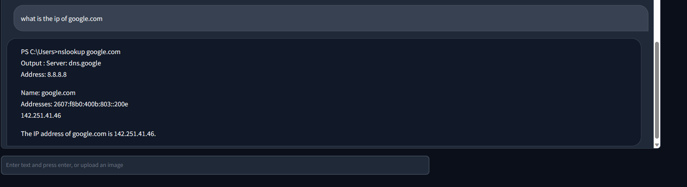

# adminGPT
 This is a bot that allows you to manage your OS by typing in normal natural language

#Warning : This code is dangerous as it allows GPT  to execute code from your system. GPT output can be unpredictable and may result in loss of data or demage to your system.
We suggest to test in a container.

Example 1


Example2



# Setup
```bash
gh repo clone IICEL/adminGPT
```
```bash
pip3 install -r requirements.txt
```
or for windows
```bash
pip install --user -r requirements.txt
```
edit the main.conf file to add your openai key


Running the code :
python3 main.py

Visit the URL : localhost:8085 in your browser

# Switching the code to other OS
## Edit Lines in os_agent.py
1. prompt on line : 27
prompt on line : 37
prompt on line : 43

2. Optional output on line 73

3. Line 82 change powershell for any other shell.

# Original blog post :
http://blog.securecortex.com/2023/06/using-latest-openai-function-api.html
